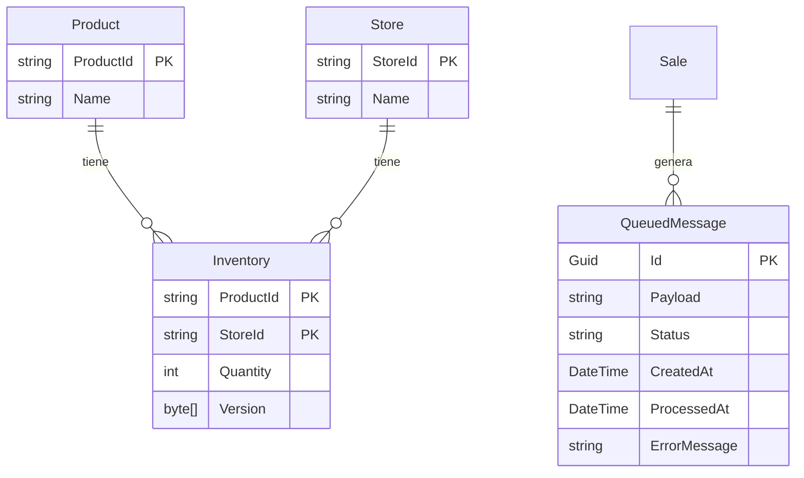

# 📦 Inventory.Data.Service

[](https://dotnet.microsoft.com/download)
[](LICENSE)
[](https://github.com/fabiobaa/Inventory.Data.Service)
[](https://test-pub-service-mana-inventory-djazchbed9bfe7h8.canadacentral-01.azurewebsites.net/swagger)
[](https://microservices.io/)

> **Microservicio de Gestión de Inventario** - Servicio especializado para la gestión de inventario distribuido en arquitecturas de microservicios

## 📋 Tabla de Contenidos

- [🚀 Quick Start](#-quick-start)
- [📖 Descripción](#-descripción)
- [🏗️ Arquitectura](#️-arquitectura)
- [🛠️ Stack Tecnológico](#️-stack-tecnológico)
- [📡 API Endpoints](#-api-endpoints)
- [💡 Flujo de Trabajo](#-flujo-de-trabajo)
- [🐳 Docker](#-docker)
- [📊 Monitoreo](#-monitoreo)
- [🔧 Desarrollo](#-desarrollo)
- [📚 Documentación](#-documentación)

## 🚀 Quick Start

```bash
# Clonar y ejecutar
git clone https://github.com/fabiobaa/Inventory.Data.Service.git
cd Inventory.Data.Service
dotnet restore && dotnet run
```

**Acceso**: [Swagger Local](https://localhost:5026/swagger) | [API Azure](https://test-pub-service-mana-inventory-djazchbed9bfe7h8.canadacentral-01.azurewebsites.net/swagger)

> 📖 **Para instrucciones detalladas**: Ver [Guía de Ejecución](run.md)

## 📖 Descripción

**Inventory.Data.Service** es un **microservicio especializado** para la gestión de inventario en arquitecturas distribuidas. Diseñado para reemplazar sistemas monolíticos que sufren de:

- ⏱️ **Alta latencia** (sincronización de 15 minutos)
- 🔄 **Inconsistencias de datos**
- 😞 **Mala experiencia de usuario**
- 💸 **Pérdida de ventas**

### 🎯 Propósito del Microservicio
- ✅ **Responsabilidad única**: Gestión completa del inventario
- ⚡ **Alta disponibilidad**: Procesamiento asíncrono de transacciones
- 🏗️ **Escalabilidad independiente**: Puede escalarse según demanda
- 🔍 **Observabilidad**: Métricas y monitoreo integrados
- 🔌 **API-first**: Integración fácil con otros microservicios

## 🏗️ Arquitectura del Microservicio

### 🎭 Patrones de Microservicios Implementados

#### **Event-Driven Architecture (EDA)**
- **Flujo asíncrono**: Las transacciones se registran como eventos en cola
- **Procesamiento en background**: `QueueProcessorService` 
- **Cola simulada**: Tabla de BD como message broker (autocontenido, sin dependencias externas)
- **Desacoplamiento**: Eventos permiten integración con otros microservicios

#### **Domain-Driven Design (DDD)**
- **`ProductController`**: Bounded Context de catálogo de productos
- **`StoreController`**: Bounded Context de gestión de tiendas
- **`SaleController`**: Bounded Context de transacciones de venta
- **`InventoryController`**: Bounded Context de inventario
- **`QueueController`**: Bounded Context de monitoreo
- **`DashboardController`**: Bounded Context de métricas

#### **Cross-Cutting Concerns**
- **`ErrorHandlerMiddleware`**: Manejo global de excepciones
- **`PerformanceMetricsMiddleware`**: Métricas de rendimiento automáticas
- **`FluentValidation`**: Validación robusta y externalizada
- **`ApiResult<T>`**: Respuestas estandarizadas para integración

### 🗄️ Modelo de Datos



## 🛠️ Stack Tecnológico del Microservicio

| Categoría | Tecnología | Versión | Propósito en Microservicio |
|-----------|------------|---------|---------------------------|
| **Framework** | .NET | 8.0 | Runtime optimizado para microservicios |
| **Web API** | ASP.NET Core | 8.0 | API REST para comunicación entre servicios |
| **ORM** | Entity Framework Core | 8.0 | Acceso a datos con su propia BD |
| **Base de Datos** | EF Core In-Memory | 8.0 | Prototipo (en producción: BD dedicada) |
| **Validación** | FluentValidation | 12.0 | Validación robusta de entrada |
| **Mapeo** | AutoMapper | 13.0 | Transformación de datos entre capas |
| **Documentación** | Swagger/OpenAPI | 9.0 | Contrato de API para otros servicios |
| **Contenedores** | Docker | Latest | Empaquetado y despliegue |
| **Cloud** | Azure App Service | - | Orquestación y escalado automático |
| **Observabilidad** | Logging + Metrics | Built-in | Monitoreo y debugging distribuido |

## 📡 API del Microservicio

| Bounded Context | Endpoints | Responsabilidad |
|-----------------|-----------|-----------------|
| **🏪 Stores** | `POST /bulk-load`, `GET /` | Gestión del catálogo de tiendas |
| **📦 Products** | `POST /bulk-load`, `GET /` | Gestión del catálogo de productos |
| **📊 Inventory** | `POST /bulk-load`, `GET /` | Gestión de inventario por tienda |
| **💰 Sales** | `POST /bulk-load` | Procesamiento asíncrono de ventas |
| **🔍 Queue** | `GET /messages` | Monitoreo de eventos y cola |
| **📈 Dashboard** | `GET /summary` | Métricas y observabilidad |

> 📖 **Ejemplos detallados**: Ver [Guía de Ejecución](run.md#-ejemplos-de-uso)

## 💡 Flujo de Trabajo del Microservicio

1. **📦 Configurar catálogos** (productos y tiendas)
2. **📊 Cargar inventario** por tienda
3. **💰 Procesar ventas** (eventos asíncronos)
4. **📈 Monitorear** estado y métricas
5. **🔌 Integrar** con otros microservicios

> 📖 **Ejemplos completos con curl**: Ver [Guía de Ejecución](run.md#-ejemplos-de-uso)

## 🐳 Docker

```bash
# Ejecución rápida
docker build -t inventory-service . && docker run -p 8080:8080 inventory-service
```

> 📖 **Docker Compose y configuración detallada**: Ver [Guía de Ejecución](run.md#-ejecución-con-docker)

## 📊 Observabilidad del Microservicio

- **📈 Dashboard**: `/api/dashboard/summary` - KPIs y métricas del servicio
- **🔍 Cola de eventos**: `/api/queue/messages` - Estado de procesamiento asíncrono
- **⚡ Métricas**: Logs automáticos de rendimiento y latencia
- **🔍 Health Checks**: Monitoreo de salud del microservicio

> 📖 **Ejemplos de monitoreo**: Ver [Guía de Ejecución](run.md#-monitoreo-y-observabilidad)

## 🔧 Desarrollo

### Estructura del Proyecto

```
Inventory.Data.Service/
├── Controllers/         # Controladores de API
├── Data/               # Contexto de base de datos
├── DTOs/               # Data Transfer Objects
├── Models/             # Modelos de dominio
├── Services/           # Servicios de negocio
├── Middleware/         # Middleware personalizado
├── Validators/         # Validadores FluentValidation
├── Config/             # Configuración y mapeos
└── Shared/             # Componentes compartidos
```

### Comandos Básicos

```bash
dotnet restore    # Restaurar dependencias
dotnet build      # Compilar proyecto
dotnet run        # Ejecutar aplicación
dotnet watch run  # Hot reload
```

> 📖 **Comandos avanzados y testing**: Ver [Guía de Ejecución](run.md#-testing)

## 📚 Documentación

- 📖 **[Guía de Ejecución](run.md)** - Instrucciones detalladas y ejemplos
- 🔗 **[API en Azure](https://test-pub-service-mana-inventory-djazchbed9bfe7h8.canadacentral-01.azurewebsites.net/swagger)** - Swagger UI desplegado
- 🐙 **[Código Fuente](https://github.com/fabiobaa/Inventory.Data.Service)** - Repositorio en GitHub

### Limitaciones del Prototipo

⚠️ **Importante**: Este es un prototipo de microservicio con las siguientes limitaciones:

- **Base de Datos In-Memory**: Los datos se pierden al reiniciar
- **Cola Simulada**: No es un message broker real
- **Sin Autenticación**: No hay sistema de seguridad implementado
- **Sin Persistencia**: No hay backup automático de datos
- **Sin Service Discovery**: No hay registro de servicios
- **Sin Circuit Breaker**: No hay patrones de resilencia

### Roadmap para Microservicio en Producción

🚀 **Evolución hacia Microservicio Completo**:

- [ ] **Base de datos dedicada** (SQL Server/PostgreSQL)
- [ ] **Message broker real** (RabbitMQ/Azure Service Bus)
- [ ] **Autenticación y autorización** (JWT/OAuth2)
- [ ] **Health checks** y readiness probes
- [ ] **Caching distribuido** (Redis)
- [ ] **Logging centralizado** (ELK Stack/Application Insights)
- [ ] **Service discovery** (Consul/Eureka)
- [ ] **Circuit breaker** y retry policies
- [ ] **API Gateway** para routing
- [ ] **CI/CD pipeline** con Docker
- [ ] **Monitoring y alerting** (Prometheus/Grafana)

---

## 🤝 Contribuciones

Las contribuciones son bienvenidas. Por favor:

1. Fork el proyecto
2. Crea una rama para tu feature (`git checkout -b feature/AmazingFeature`)
3. Commit tus cambios (`git commit -m 'Add some AmazingFeature'`)
4. Push a la rama (`git push origin feature/AmazingFeature`)
5. Abre un Pull Request

## 📄 Licencia

Este proyecto está bajo la Licencia MIT. Ver el archivo [LICENSE](LICENSE) para más detalles.

---

<div align="center">

**Desarrollado con ❤️ por [Fabian Obando](https://github.com/fabiobaa)**

[](https://github.com/fabiobaa)
[](https://linkedin.com/in/fabiobaa)

</div>